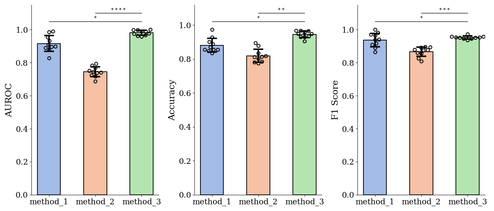

# Tools for Statistical Plotting

**Chen Liu** @ [Krishnaswamy Lab](https://krishnaswamylab.org/members), Yale University

[](https://pypi.org/project/statistical-plot/)
[](https://pypi.python.org/pypi/statistical-plot/)
[](https://pypi.python.org/pypi/statistical-plot/)
[](https://pypi.python.org/pypi/statistical-plot/)
[](https://www.python.org/)

Please kindly **Star** [](https://github.com/ChenLiu-1996/StatsPlot/) this repo for better reach if you find it useful.

## Installation
```
pip install statistical-plot
```

## Example Plots
### Statistical Bar Plot




## Usage
### Statistical Bar Plot

```
from statistical_plot import sbplot
fig = plt.figure(figsize=(12, 6))
ax = fig.add_subplot(1, 2, 1)

np.random.seed(1)

method_list = ['method_1', 'method_2', 'method_3']

auroc_data_dict = {
    'method_1': np.clip(np.random.normal(loc=0.92, scale=0.04, size=(10,)), 0, 1),
    'method_2': np.clip(np.random.normal(loc=0.75, scale=0.03, size=(10,)), 0, 1),
    'method_3': np.clip(np.random.normal(loc=0.98, scale=0.02, size=(10,)), 0, 1),
}
auroc_pvals_dict = {
    'method_1 vs method_3': 0.01,
    'method_2 vs method_3': 5e-5,
}

acc_data_dict = {
    'method_1': np.clip(np.random.normal(loc=0.89, scale=0.05, size=(10,)), 0, 1),
    'method_2': np.clip(np.random.normal(loc=0.81, scale=0.04, size=(10,)), 0, 1),
    'method_3': np.clip(np.random.normal(loc=0.94, scale=0.03, size=(10,)), 0, 1),
}
acc_pvals_dict = {
    'method_1 vs method_3': 0.01,
    'method_2 vs method_3': 0.001,
}

f1_data_dict = {
    'method_1': np.clip(np.random.normal(loc=0.92, scale=0.04, size=(10,)), 0, 1),
    'method_2': np.clip(np.random.normal(loc=0.87, scale=0.03, size=(10,)), 0, 1),
    'method_3': np.clip(np.random.normal(loc=0.95, scale=0.02, size=(10,)), 0, 1),
}
f1_pvals_dict = {
    'method_1 vs method_3': 0.01,
    'method_2 vs method_3': 3e-4,
}

plt.rcParams['font.family'] = 'serif'
plt.rcParams['legend.fontsize'] = 12
fig = plt.figure(figsize=(14, 6))
ax = fig.add_subplot(1, 3, 1)
ax = sbplot(ax=ax, method_list=method_list, data_dict=auroc_data_dict, pvals_dict=auroc_pvals_dict, ymin=0)
ax.set_ylabel('AUROC', fontsize=18)

ax = fig.add_subplot(1, 3, 2)
ax = sbplot(ax=ax, method_list=method_list, data_dict=acc_data_dict, pvals_dict=acc_pvals_dict, ymin=0)
ax.set_ylabel('Accuracy', fontsize=18)

ax = fig.add_subplot(1, 3, 3)
ax = sbplot(ax=ax, method_list=method_list, data_dict=f1_data_dict, pvals_dict=f1_pvals_dict, ymin=0)
ax.set_ylabel('F1 Score', fontsize=18)

fig.tight_layout(pad=1)
fig.savefig('./sbplot_example.png')
```